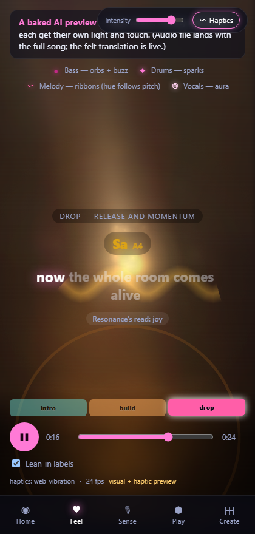
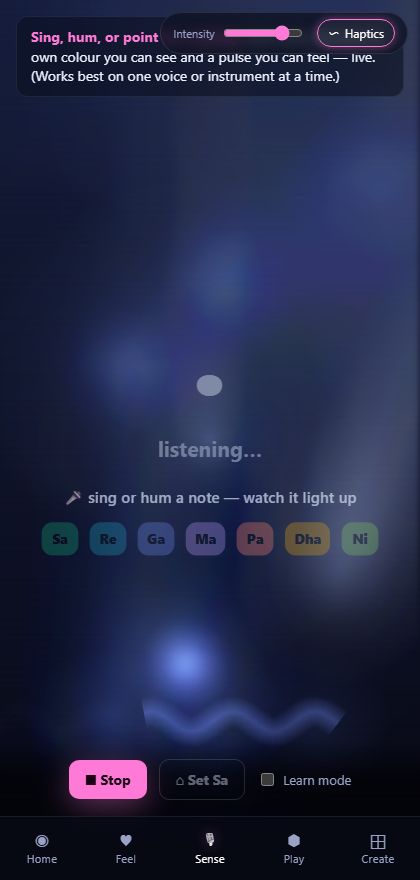
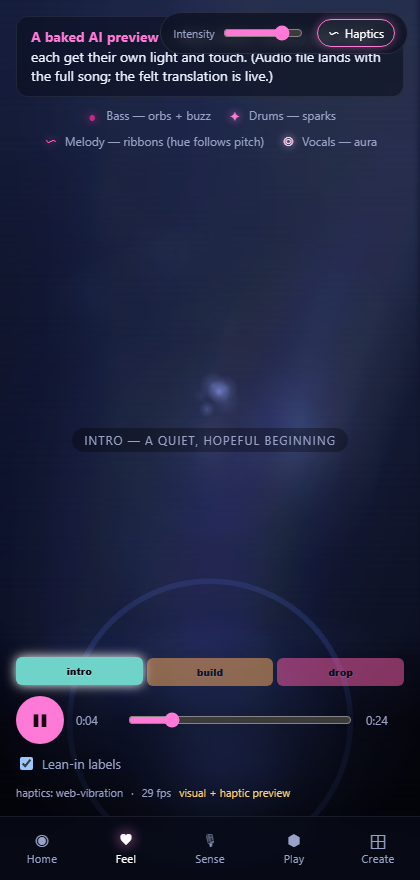
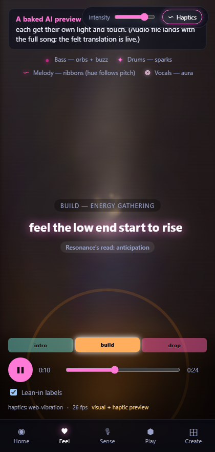
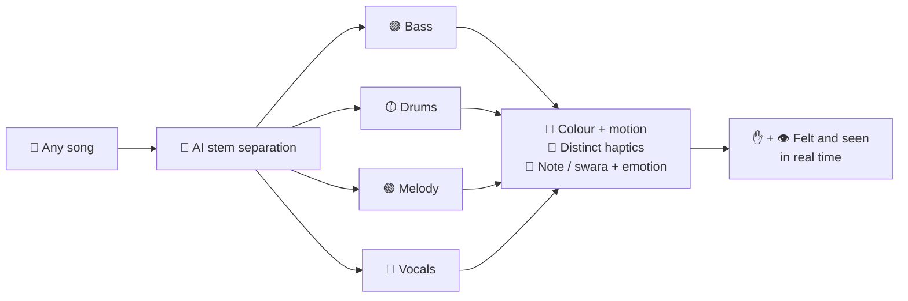

<div align="center">

# 🎵 Resonance

### Music you can **feel**. Music you can **see**.

A free, AI-powered, multi-sensory music experience for the **Deaf and hard-of-hearing**.
We don't try to *fix* hearing — we **reimagine music itself**, translating any song into light, motion, and touch, in real time.

*Built for the Microsoft Global Hackathon.*

<br/>

<table>
  <tr>
    <td align="center"><b>FEEL — feel every instrument</b></td>
    <td align="center"><b>SENSE — every note has a colour</b></td>
  </tr>
  <tr>
    <td align="center"></td>
    <td align="center"></td>
  </tr>
</table>

</div>

---

## 💔 The problem

> Imagine a world where music… is silent.

For over **1.5 billion people** living with hearing loss, that isn't imagination — it's everyday life. Streaming apps gave them the *lyrics*. They never gave them the **music** — the bass in your chest, the build, the drop. That feeling just gets left out.

## 💡 The idea

Resonance takes any song and turns it into two things a Deaf person **can** experience — **light** and **touch**.

The key insight: our AI **separates a song into its individual instruments** — bass, drums, melody, voice — and gives **each one its own colour, motion, and vibration**. Most visualizers blur everything into one blob. Resonance gives every instrument its own identity, so you can finally tell them apart with your **eyes** and your **hands**.

---

## ✨ The four pillars

| Pillar | What it does |
|---|---|
| 🌊 **FEEL** | Play a song and experience it as flowing, note-coloured "ink-in-water" visuals **and** distinct per-instrument haptics. Feel the bass drop in your hand. |
| 🎤 **SENSE** | Live mic mode — hum, sing, or point it at an instrument and Resonance reads the note in real time, lighting up its colour and its **swara** (Sa Re Ga Ma Pa Dha Ni) with its own pulse. |
| 🥁 **PLAY** | Tap instrument pads and feel how different each one is — a heavy kick, a sharp hat, a soft swelling pad. |
| 🎨 **CREATE** | *(Roadmap)* Compose music through touch, colour, and movement. |

---

## 📸 It moves with the song

The visuals and emotion shift as the music does — a quiet, cool **intro** rises into a warm **build** and explodes into the **drop**:

<div align="center">
<table>
  <tr>
    <td align="center"><br/><sub>INTRO — quiet & hopeful</sub></td>
    <td align="center"><br/><sub>BUILD — energy gathering</sub></td>
    <td align="center"><br/><sub>DROP — the room comes alive</sub></td>
  </tr>
</table>
</div>

---

## ⚙️ How it works



1. **Separate** — a Python audio pipeline splits the track into instrument **stems** (bass / drums / melody / vocals).
2. **Analyse** — each stem's energy, pitch, and the song's emotional/section structure are extracted.
3. **Translate** — every instrument is mapped to its own **colour + motion** (PIXI.js fluid visuals) and its own **haptic texture**.
4. **Deliver** — it all plays back live on a phone: visuals on screen, vibration in your hand.

> **Why it's different:** a normal visualizer reacts to *one* mixed waveform. Resonance understands the song *part by part* — which is what lets the bass get its own pulse while the melody gets its own light.

---

## 🗂️ Project structure

```
app/        Web app — the Resonance experience (Vite + TypeScript + PIXI.js)
mobile/     Expo wrapper — hosts the web app in a WebView and bridges native iOS haptics
pipeline/   Python audio pipeline — stem separation & analysis
docs/        Screenshots used in this README
```

---

## 🚀 Running locally

**Web app:**
```powershell
cd app
npm install
npm run dev          # serves on http://localhost:5173
```

**Mobile (Expo Go on a physical phone — needed for iOS haptics):**
```powershell
cd mobile
npm install
$env:EXPO_PUBLIC_WEBAPP_URL = "https://<your-public-web-url>"
npx expo start --tunnel
```
Then scan the QR code with **Expo Go**.

> **iOS haptics note:** in-browser vibration is blocked by WebKit on all iOS browsers, so native iOS haptics work **only** through the Expo wrapper (`mobile/`). Android Chrome supports the web vibration path directly.

---

## ♿ Accessibility & mission

Resonance is built around **inclusion, powered by AI** — directly serving Microsoft's mission to *empower every person and every organization on the planet to achieve more.* It's designed with the Deaf and hard-of-hearing community in mind: open captions, a clear legend for what every colour and shape means, a photosensitivity-safe flash limiter, and `prefers-reduced-motion` support throughout.

## 🔭 What's next

- **CREATE** mode — compose songs through touch, colour, and movement.
- More instruments and richer haptic vocabularies.
- Bring-your-own-song uploads with on-device separation.

---

## 📄 License

Released under the [MIT License](LICENSE).

---

<div align="center">

*Music was never meant to be heard alone.*
**With Resonance, it can be felt, seen, and lived — by everyone.**

</div>
